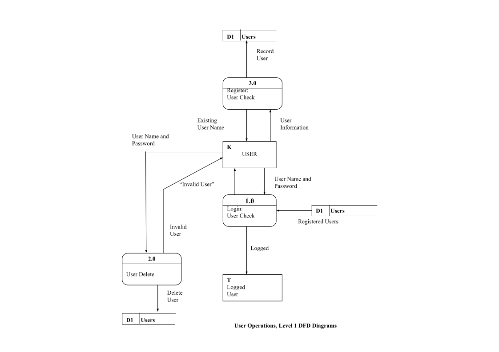
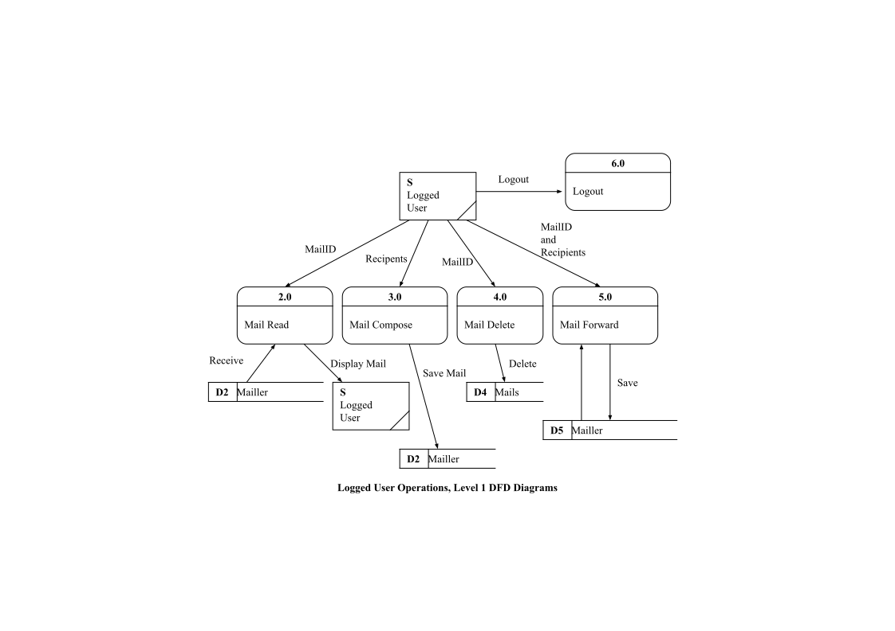

<p align="center">
    
</p>

<h1 align="center">
    YILDIZ TECHNICAL UNIVERSITY<br />
    FACULTY OF  ELECTRICAL AND ELECTRONICS ENGINEERING<br />
    DEPARTMENT OF COMPUTER ENGINEERING
</h1>


<h1 align="center">
    PROGRAMMING LANGUAGES<br />
    2. TERM PROJECT
</h1>


<h1 align="center">MAIL SERVER&CLIENT APPLICATION</h1>


<p align="center">Project Supervisor: Doc. Dr. Elif KARSLIGİL</p>


<p align="center">
    Project Group<br />
    01011029, Ahmet SAÇAKLI<br />
    01011033, Yavuz KAVUŞ<br />
</p>


<p align="center">
    İstanbul, 2004
</p>

### Terms Used in Program

These definitions are  defined in “proje.h” file.
```c
#define NEWUSER 0     //new user will be signed up
#define LOGIN 1       // member will log in
#define LOGOUT 2      // member will log out
#define DELETEUSER 3  // delete member
#define DELETEMAIL 4  // delete mail
#define FORWARD 5     // forward message
#define CANCEL 6      // cancel current action
#define EXISTUSER 7   //  another member already has the same name
#define ACCEPT 8      // action completed
#define INVALID 9     // invalid name or password
#define READ 10       // read message
#define NEWMAIL 11    // compose new message
#define REFRESH 12    // refresh all messages
#define ERROR 13      // error occurred
```
These macros are used during data flow between the server and the client. Usually, when one of them gets information from the other. What kind of operation will be made between the server and the client is specified in the "what" variable. The macros described above are assigned to the what variable, so the programmer will not have to know what these numbers mean. 
```c
typedef struct {
char username[15];  //username will be used when loging in    
char password[5];   //password for save login
} CRIPTO;
```
This struct holds the username and password information.<br /><br /><br />

```c
typedef struct {
    char name[30];  //user’s first and last name
    CRIPTO cripto;  // stores username and password
    char telno[12]; // phone number
    char age;       // user’s age
} INFO;
```
This struct used to transfer data during the Sign up process<br /><br /><br />

```c
typedef struct {
    char from[15];    // username of mail’s sender
    char subject[30];  // mail subject
    char to[200];    // recipient username, can contain multiple user name
    char status;   //read=1 or unread=0 ?
    char mail[1024]; // mail content
} MAIL;
```
This struct used to compose/forward a mail.<br /><br /><br />


### General Structure of the Program

Under the directory Server running, there is a folder named "accounts" which includes accounts folder for each user. These user account folders are named with the username of users. In the user account folder, an "info.dat" file and mail files exist. “info.dat” file has an INFO type struct which holds information related to the user. In each mail file contains MAIL type struct that keeps information about the mail. Names of mails are given by converting a randomly generated integer. A check is made against duplicate names. 

To delete a user, firstly all the files under the user folder are deleted and later the user removed from the data holder.


### Data Flow Diagrams(DFD)
<p align="center">
    <br />
    User Operations, Level 1 DFD Diagrams
</p>
<p align="center">
    <br />
    Logged User Operations, Level 1 DFD Diagrams
</p>
